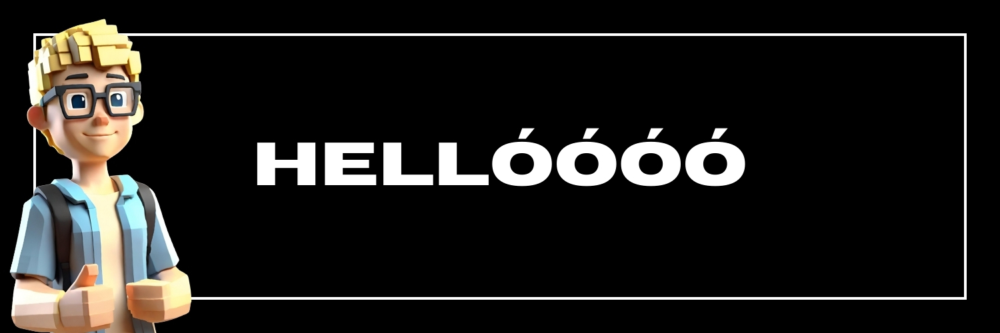
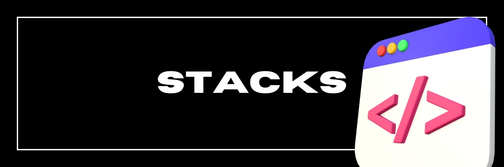

<h3>Student/Tanuló 🎒</h3>

###
👦🏼 My name is Bencso/Bencsó and I'm an 18-year-old boy who loves playing games and programming.  <i> Bencsónak hívnak és egy 18 éves fiú vagyok, aki imád játszani és programozni. </i>
###
🙏 I'm really excited to tell you a little bit about myself. My ultimate goal is to become an experienced programmer and  even create educational programming videos that inspire others.   <i> Nagyon izgatott vagyok, hogy meséljek egy kicsit magamról. A célom az, hogy tapasztalt programozó legyek, és akár másokat inspiráló programozós oktatóvideókat készítsek. </i> 
###

📚 Currently, I am focused on learning <b>HTML , Bootstrap , Javascript , CSS , Sass , C#, Angular, and Vue.js.</b> I'm really excited to see where these skills will take me!    
<i> Jelenleg a <b>HTML , Bootstrap , Javascript , CSS , Sass , C#, Angular, és Vue.js.</b> tanulására koncentrálok. Nagyon izgatottan várom, hogy hova vezetnek majd ezek a készségek! </i>
###

Here you'll find various projects and trying that showcase my passion and interest in programming. I hope you find them interesting and useful.   
<i>Itt találsz különböző projekteket és próbálkozásokat, amelyek a programozás iránti szenvedélyemet és érdeklődésemet mutatják. Remélem, érdekesnek és hasznosnak találod őket. </i>

<ul>
  <li><a href="https://github.com/bencso/tictactoe" target="_blank">Tic-Tac-Toe</a></li>
 <li><a href="https://github.com/bencso/SJW2024_Babolnai_Bence" target="_blank">Skills Junior 2024 verseny webfejlesztő kategória második fordulójának feladata</a></li> (<i>Nincs befejezve</i>)
</ul>

###
You are welcome to have a look at my account, which has been active since the beginning of the year 2024.   <i>Szívesen látlak benneteket a fiókomban, amely a 2024-es év eleje óta aktív.</i>
###
<h3 align="left">🔥 My Stats | <i>Statisztikám</i>:</h3>

###

  

###

